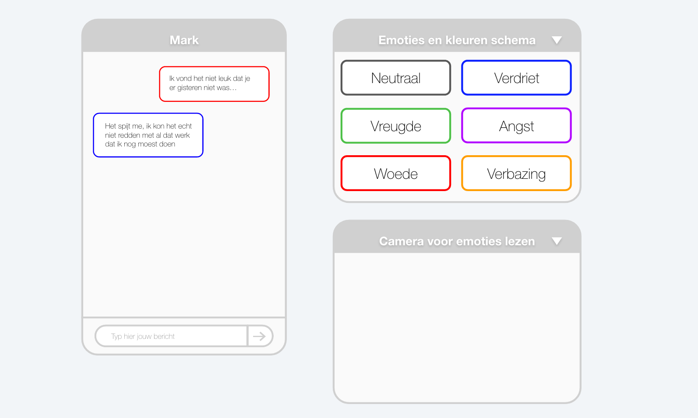
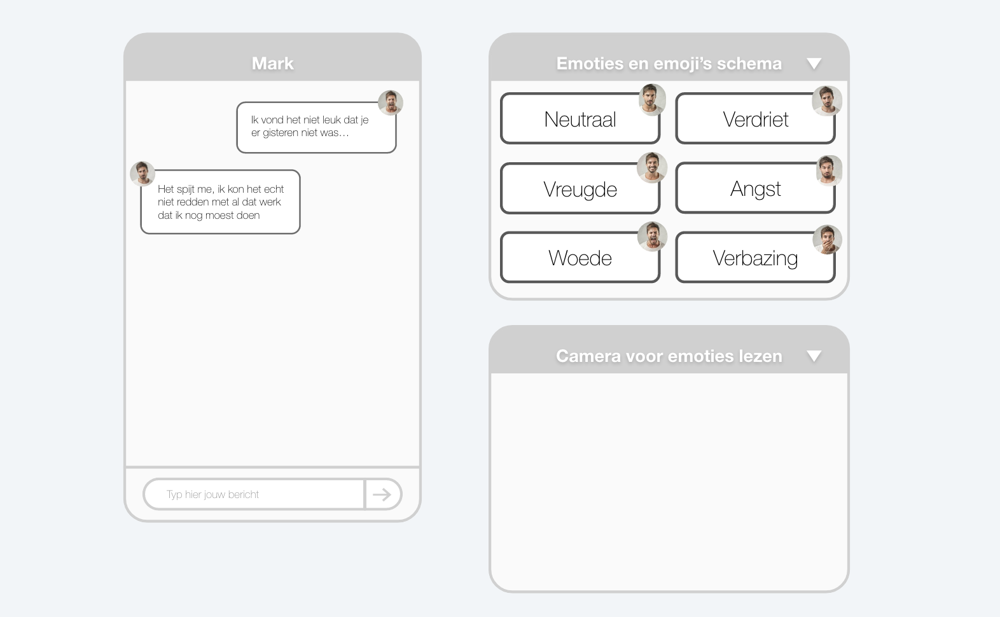
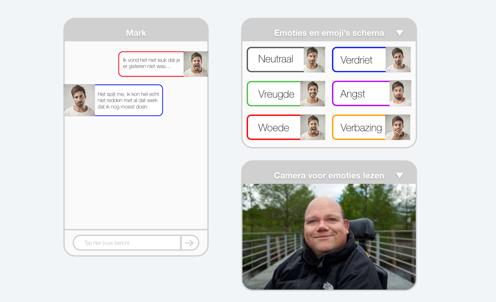
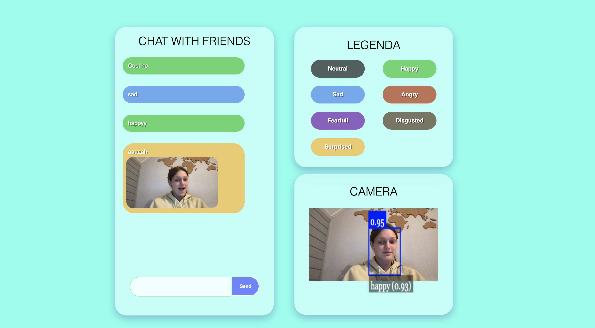

# Human Centered Design @cmda-minor-web · 2020/21

# Live link:
https://emotions-chat.herokuapp.com/

## Table of Contents
- :pencil2: Beschrijving
- :books: Drie Concepten
- :pushpin: Gekozen Concept
- :man_technologist: User Scenario
- :bookmark: Moscow
- :tipping_hand_person: Exclusive design principles
- :family_man_woman_boy_boy: User tests
- :monkey: API
- :hourglass_flowing_sand: Real time Events
- :package: Used Packages
- :arrow_down: Install project


### :pencil2: Beschrijving
#### Opdracht:
Dit vak draait om human centered design. Iedereen ontwerpt voor een user. Ik ontwerp voor Eric. 
Eric is 48 jaar en woont in Amsterdam. Hij heeft Interaction Design aan de HKU gestudeerd. Eric zelf zit in een elektrische rolstoel. Hij heeft niet de beschikking over de fijne motoriek. 
#### Probleem:
Voor Eric ga ik een chat ontwerpen waarbij bodylanguage wordt overgebracht, omdat emoji's niet genoeg spreken of verkeerd geinterpreteerd worden. Hij wil kunnen zien wat mensen bedoelen met berichtjes die hij binnen krijgt en zelf ook meer betekenis geven aan zijn berichten aan anderen.
#### Oplossing:
Zie gekozen concept


### :books: Drie Concepten
#### Concept 1: Emotie en Kleur
Voor het eerste concept heb ik bedacht om met de emotie detectie API emoties af te lezen van de gebruiker en per emotie een kleur in te stellen. Wanneer je dan een bericht stuurt krijgt het bericht de kleur van de emotie die jij op dat moment voelt en uit. 


##### Hoe te bouwen:
- Begin met HTML, CSS en JS opzetten
- API call
- Render homepage
- Maak chat functie
- Stel kleuren per emoties in


#### Concept 2: Snapshots
Voor dit concept leek het mij een goed idee om een foto van jezelf te sturen naar de persoon waarmee je chat. Zodat deze persoon direct kon zien hoe een bericht bedoelt wordt.




##### Hoe te bouwen:
- Begin met HTML, CSS en JS opzetten
- API call
- Render homepage
- Maak chat functie
- Maak snapshot en stuur naar gebruiker

#### Concept 3: Snapshot en kleur per emotie
Voor dit concept wil ik de vorige twee concepten combineren. Dus je leest de emotie af met de API en hierdoor veranderd de kleur van je bericht per emotie. En voor een extra beeld ook een image die het nog duidelijker maakt wat de emoties is die je wilt overbrengen.



##### Hoe te bouwen:
- Begin met HTML, CSS en JS opzetten
- API call
- Render homepage
- Maak chat functie
- Stel kleuren per emoties in
- Maak snapshot en stuur naar gebruiker

### :pushpin: Gekozen concept

Het concept dat ik gekozen heb ik concept 3.
Ik ga doormiddel van de Face API emoties aflezen van de gebruikers gezicht. Vervolgens krijgt elke emotie een unieke kleur die de emotie moet voorstellen. Helaas is kleur nog niet sprekend genoeg. Denk aan rood, staat dit voor liefde of juist voor woede. Om er voor te zorgen dat kleur duidelijker wordt, ga ik een legenda maken voor de 7 emoties en hun kleuren. Daarnaast zal de chat een feature hebben om een snapshot mee te sturen naar de andere gebruikers. Deze snapshot wordt genomen wanneer je het bericht verstuurd, net zoals bij de emotie. De emoties worden continu afgelezen van je gezicht maar de emotie die op het moment van sturen wordt afgelezen, wordt gebruikt.
Daarnaast wil ik het mogelijk maken om keuze te hebben uit de verschillende features. Dit zorgt er voor dat de gebruikers de touwtjes in de handen hebben. Snapshot, kleur of beide, alles kan!

#### Features:
- chat
- Emotie detectie
- Aan of uit buttons
- kleur per emotie
- snapshot

### :man_technologist: User scenario
Eric is 48 jaar en woont in Amsterdam. Hij heeft Interaction Design aan de HKU gestudeerd. Eric zelf zit in een elektrische rolstoel. Hij heeft niet de beschikking over de fijne motoriek. Eric wilt een chat die de bodylanguage van gebruikers laat zien/merken.
Eric praat veel met mensen online maar merkt vaak dat er niet goed begrepen wordt, wat iemand bedoelt met een bericht. Is dit sarcastisch, grappig of stom bedoeld? Ook worden emoji's vaak verkeerd geinterpreteerd en weten mensen niet goed wat een emoji betekent. Doormiddel van lichaamstaal kun je veel gemakkelijker zien hoe iemand iets bedoelt. Nu ga ik geen directe lichaamstaal gebruiken maar wel emoties in het gezicht. Ook hier kun je heel veel informatie uit halen, zo zie je veel sneller of iemand iets sarcasitisch of serieus bedoeld. 

Zo zal het voor Eric gaan: <br>
Eric opent de emotions chat. De pagina zal vragen of de camera toegang mag. Wanneer Eric toegang geeft aan de camera verschijnt zijn hoofd rechts onderin de pagina. Eric ziet dan het beeld van zijn webcam. Eric kan nu gaan chatten met andere. Er moet alleen wel nog iemand anders de website openen om mee te kunnen chatten. Eric nodigt een vriend uit en beginnen te praten. Eric typt een bericht in en klikt op send. Op het moment van versturen wordt er door de face API een emotie gedetecteerd. Deze emotie heeft een typerende kleur. Het bericht dat Eric heeft verzonden krijgt de kleur van zijn emotie. Ook zie je dat er een foto's is gestuurd naar de ander gebruiker. Deze foto is tegelijk genomen met het verzenden van het bericht. Eric krijgt direct een bericht terug van zijn vriend, waarbij ook de emotie in kleur is weergeven er een snapshot is meegestuurd. Eric ziet direct aan zijn vriend dat het bericht grappig bedoeld is. Zijn vriend heeft een grote lach op zijn gezicht in de snapshot en de kleur van het bericht is groen. Groen staat namelijk voor vreugde. De snapshot verdwijnt wanneer een nieuw bericht gestuurd wordt. De nieuwe snapshot verschijnt weer naast het nieuwe bericht. 


### :bookmark: Moscow
#### Must have:
- [x] Chat
- [x] Api connectie
- [x] Met socket.io chat beheren
- [x] snapshot sturen
- [x] Kleur per emotie

#### Should have:
- [x] aan en uit buttons kleur
- [x] optie voor snapshot wel of niet

#### Could have:
- [ ] keuze uit vaste emotie hoofden van jezelf of snapshot op het moment

#### Would have:
- [ ] Meer doen aan uiterlijk website

### :tipping_hand_person: Exclusive design principles

- Study situation: <br>
Eric heeft niet de beschikking over de fijne motoriek. Hij gebruikt een game muis met hoge dpi en mechanisch toetsenbord (weinig toetsen nodig) of draadloos toetsenbord waar niet veel kracht voor nodig is. Gebruikt vaak spraak dictatie om teksten te typen omdat dit sneller is dan typen. Ik heb dit toegepast door er voor te zorgen dat er geen extra buttons ingedrukt hoeven worden. Alleen de button van verstuur message, of zelfs een enter op het toetsenbord zorgt er voor dat alle actie aangeroepen en uitgevoerd worden.

- Ignore conventions: <br>
Door meerdere functionaliteiten toe te voegen aan de app die eigenlijk het zelfde doen. Namelijk de kleur en de snapshot, ze brengen allebei emotie over naar de andere gebruiker. In de huidige design conventies zal dit gezien worden als overbodig en zou daarom weg gelaten moeten worden. "Een functie die emotie overbrengt is genoeg", maar misschien werkt het wel veel beter voor gehandicapten om juist meerdere fucties het zelfde te laten zien, op net een andere manier. Misschien maakt dit het juist nog duidelijker voor de mensen die het al zo lastig hebben om devices en het internet te gebruiken.

- Prioritise identity: <br>
Eric is zelf ook een designer, hierdoor was zijn feedback heel nuttig. Door zijn feedback voelt het alsof we samen op dit concept zijn uitgekomen. Ook zie je door de tests veel beter wat voor Eric goed en niet goed te doen is, en wat hij leuk vind, om moet lachen en eigenlijk helemaal niet ziet zitten. Dit zijn de meest waardevolle insights.

- Add nonsense: <br>
Gekke beelden, leuke plaatjes, of zoals het bij mij is toegepast, een snapshot van jezelf van hoe jij je op dat moment voelt gecombineerd met de kleur die sprekend is voor die emotie. Het leuke aan de api is dat je ook een gek gezicht kan trekken en daar een emotie uitgehaald kan worden, en vervolgens deze 'gekke bek' naar de andere gebruikers wordt gestuurd zodat zij ook kunnen lachen. Of juist wanneer je heel erg boos of verdrietig bent, kun je dit heel erg benadrukken door de snapshot en kleur die gecombineerd wordt. Je bericht wordt veel krachtiger door deze mogelijkheden. De twee vrij gelijke functies zijn misschien niet allebei nodig, zoals ik al eerder vermelde, maar het is wel een stuk leuker en krachtiger op deze manier.

### :family_man_woman_boy_boy: User tests
In de wiki's beschijf ik 3 testen van de afgelopen weken. [wiki](https://github.com/Lottetekulve/human-centered-design-2021/wiki)

### :monkey: API
#### Welke API:
Face-api.min.js in de public file.


#### Hoe gebruikt:
- loadFacialRecognition function: 
```
async function loadFacialRecognition() {
  await Promise.all([faceapi.nets.tinyFaceDetector.loadFromUri('./models'), faceapi.nets.faceLandmark68Net.loadFromUri('./models'), faceapi.nets.faceRecognitionNet.loadFromUri('./models'), faceapi.nets.faceExpressionNet.loadFromUri('./models')])
```
- detectEmotion function:
```
setInterval(async () => {
    const detections = await faceapi.detectAllFaces(video, new faceapi.TinyFaceDetectorOptions()).withFaceExpressions()
    const resizedDetections = faceapi.resizeResults(detections, displaySize)
    canvas.getContext('2d').clearRect(0, 0, canvas.width, canvas.height)
    faceapi.draw.drawDetections(canvas, resizedDetections)
    faceapi.draw.drawFaceExpressions(canvas, resizedDetections)
```


### :hourglass_flowing_sand: Real-Time Events
- Connection: <br>
Wanneer de webpagina wordt geopent, wordt er een connectie gemaakt met socket.io. Dit event roept alle andere real time events aan, message en disconnect.
```
io.on('connection', async socket => {
```
- Message:<br>
Het message event zorgt er voor dat de alle berichten en usernames, naar alle servers worden gestuud.
```
socket.on('message', (message) => {
    io.emit('message', message)
  })
socket.on('message', function(message) {
  const element = document.createElement('li')
  element.textContent = message.value
  element.style.setProperty('--background', `var(--${message.emotion})`)
  messages.appendChild(element)
  messages.scrollTop = messages.scrollHeight
})
````

- Disconnect: <br>
Wanneer iemand het spel verlaat wordt er een bericht getoont dat een speler het spel verlaten heeft.
```
socket.on('disconnect', () => {
    console.log('user disconnected')
  })
```


### :package: Used Packages
- express
- socket.io
- dotenv
- handlebars
- nodemon

Install:
1. npm install
2. npm install express, socket.io, dotenv, handlebars
3. npm install -D nodemon
4. require: `const ... = require('...')`


### :arrow_down: Install project
1. clone repo: 
``` 
https://github.com/Lottetekulve/human-centered-design-2021.git
```
2. Install used packages: 
```
npm install
```
3. Start op het web: 
```
npm run dev
```
4. Te vinden op: http://localhost:5000/